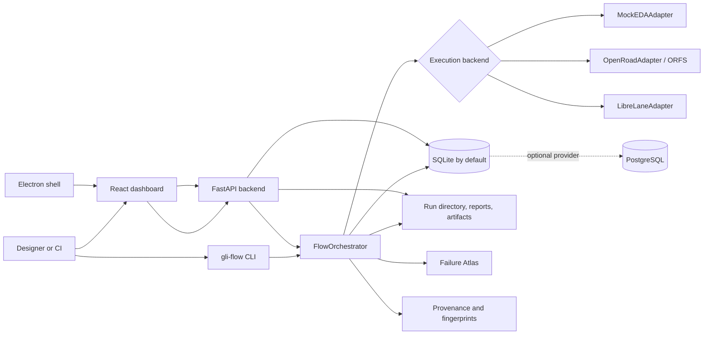
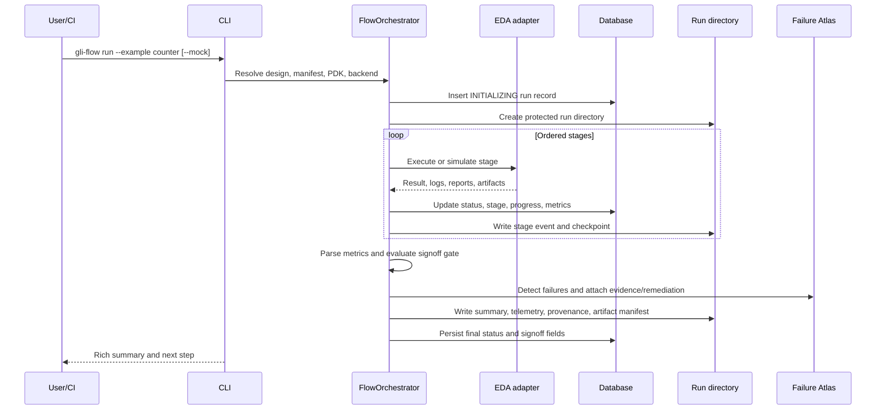

# GLI-FLOW

GLI-FLOW is an open-source, Python-based RTL-to-GDS orchestration system for
digital ASIC experiments and reproducible flow execution. It accepts a design
directory containing a `gli_manifest.yaml`, selects a mock or real backend, runs
an ordered implementation and signoff pipeline, stores run state in a local
database, and writes reports, artifacts, checkpoints, telemetry, and provenance
records. A FastAPI service and React dashboard expose the same local run data.

The project is currently published as `v1.1.0-beta`. It is an orchestration and
diagnostics tool, not a foundry signoff service. A successful mock run is a
configuration/orchestration check and is never evidence that a design is
timing-clean, DRC/LVS-clean, functionally correct, or manufacturable.

## What it provides

- A `gli-flow` CLI for setup, validation, execution, history, diagnosis,
  reports, comparison, recovery, export, and support bundles.
- A 29-stage orchestration model covering synthesis, physical implementation,
  signoff checks, QoR extraction, and packaging.
- Mock execution through `MockEDAAdapter`, allowing manifest and control-flow
  validation without installed EDA tools.
- Real-tool adapters for OpenROAD/ORFS and LibreLane, with PDK discovery and
  tool validation.
- Local SQLite persistence by default, with optional PostgreSQL provider
  selection when explicitly configured.
- Failure Atlas detection, signatures, evidence classification, root-cause
  analysis, remediation suggestions, resolution records, and local search.
- Reproducibility manifests, environment fingerprints, stage checkpoints,
  artifact manifests, run comparisons, and regression detection.
- A local React dashboard with run monitoring, artifacts, metrics, Failure Atlas,
  provenance, learning, comparison, feedback, and system pages.
- An optional Electron desktop shell with native file access and a local Monaco
  RTL Workbench.
- Local-only telemetry by default. Upload modes require an explicit telemetry
  choice; core execution does not require cloud services, AI, or
  telemetry uploads.

## Architecture



The CLI and backend share the Python implementation and database schema. The
dashboard is a client of the FastAPI service; it does not implement a second
execution engine. The Electron application launches or attaches to that same
backend and serves the built dashboard.

## Execution flow



## Install

### Linux or WSL2: one command

The hosted installer downloads or reuses a source checkout under
`~/.gli-flow`, creates `.venv`, installs the package with dashboard support,
runs a non-interactive mock smoke test, and prints the activation command:

```bash
curl -fsSL https://raw.githubusercontent.com/Jegadiswar-SM/gli-flow-1.0/main/gli-flow-asic/scripts/install.sh | bash
```

For the complete Electron desktop app and Monaco RTL Workbench, install
Node.js 24.18.0 first, then use the desktop variant:

```bash
curl -fsSL https://raw.githubusercontent.com/Jegadiswar-SM/gli-flow-1.0/main/gli-flow-asic/scripts/install.sh | bash -s -- --desktop
```

It installs the frontend dependencies, builds the self-hosted Monaco UI,
installs Electron, and prints the launch command. System EDA tools remain a
separate optional install step.

The script is designed to be re-runnable. In WSL2 it asks once whether to run
the optional system-level EDA installation. Read [Installation](docs/INSTALL.md)
for manual setup, Docker, real-tool installation, and uninstall behavior.

Windows users should start with [Windows + WSL2 setup](docs/WINDOWS_WSL2_SETUP.md).
Native Windows and macOS paths are not the primary supported EDA environment.

### Manual source install

```bash
git clone https://github.com/Jegadiswar-SM/gli-flow-1.0.git
cd gli-flow-1.0/gli-flow-asic
python3 -m venv .venv
source .venv/bin/activate
python -m pip install -e ".[dashboard,dev]"
```

The package requires Python `>=3.9,<3.13`. The dashboard frontend has a
separate Node/npm environment; use the versions declared in
`dashboard/.nvmrc` and `dashboard/package.json`.

## Quick start

```bash
# Confirm the local/mock path without requiring EDA tools.
gli-flow doctor --for mock --non-interactive
gli-flow smoke-test --non-interactive

# Run the built-in counter example in simulated mode.
gli-flow run --example counter --mock --non-interactive

# Create a starter design interactively.
gli-flow quickstart
```

For a custom design, create or inspect a manifest and validate it before a run:

```bash
gli-flow init my_design
gli-flow validate my_design
gli-flow run my_design --mock
```

The canonical built-in example form is `gli-flow run --example counter`; a bare
example name is also accepted by the implementation as a shorthand.

## Dashboard and desktop shell

Start the browser dashboard with:

```bash
gli-flow dashboard
```

The CLI starts the backend on `http://127.0.0.1:8000`, starts Vite on
`http://127.0.0.1:5173`, and opens the browser when the host environment allows
it. If the browser does not open, visit `http://127.0.0.1:5173` manually. Use
`gli-flow dashboard --backend-only` to run only the API and check
`http://127.0.0.1:8000/health`.

The optional Electron shell uses the same backend:

```bash
cd dashboard && npm ci && npm run build
cd ..
npm --prefix desktop ci
GLI_FLOW_PROJECT_ROOT="$PWD" \
GLI_FLOW_PYTHON="$PWD/.venv/bin/python" \
npm --prefix desktop run start
```

See [Dashboard and desktop](docs/user_guide/dashboard.md) for attach mode,
Workbench write authorization, and frontend development.

## Recovery and diagnosis

Run history and diagnostics are local-first:

```bash
gli-flow history
gli-flow diagnose <run_id>
gli-flow support-bundle --run-id <run_id>
gli-flow rerun <run_id> --from <stage>
```

`rerun` creates a new run linked to the source run and reuses verified
checkpoints when the requested stage is safe to resume. The support bundle is
redacted for common secrets and local absolute paths. Review it before sharing.

## Configuration at a glance

Configuration is resolved from built-in defaults, the user configuration,
project configuration, and environment overrides. The main user/project keys
are `pdk_root`, `workspace`, `db_path`, `telemetry`, `orfs_root`,
`backend_port`, `log_level`, and `log_dir`.

Common environment overrides include:

```text
GLI_FLOW_PDK_ROOT       GLI_FLOW_WORKSPACE       GLI_FLOW_DB_PATH
GLI_FLOW_ORFS_ROOT      GLI_FLOW_BACKEND_PORT    GLI_FLOW_LOG_LEVEL
GLI_FLOW_LOG_DIR        PDK_ROOT                 ORFS_ROOT
GLI_FLOW_DB             GLI_FLOW_DASHBOARD_PORT
```

Read [Configuration](docs/reference/configuration.md) for precedence,
database provider selection, telemetry files, CORS, AI, WSL2, and desktop
variables.

## Repository structure

```text
gli-flow-asic/
├── gli_flow/                 Python package: CLI, orchestrator, adapters, DB, telemetry
├── backend/                  FastAPI service and dashboard API
├── dashboard/                React/Vite web application
├── desktop/                  Optional Electron shell
├── examples/                 Built-in RTL designs and manifests
├── designs/                  User/design workspace examples
├── configs/                  Runtime, toolchain, policy, and PDK templates
├── failure_atlas/            Failure schemas, signatures, knowledge, and analysis
├── tests/                    Unit, integration, adversarial, regression, and E2E tests
├── scripts/                  Install, validation, migration, and analysis utilities
├── docs/                     Maintained documentation, references, audits, and archive
├── Dockerfile                Ubuntu 22.04 image with open-source EDA dependencies
├── setup.py / pyproject.toml Python packaging and pytest configuration
└── .github/workflows/        CI jobs and release checks
```

`outputs/`, `build/`, local databases, `node_modules/`, and virtual environments
are generated or machine-local state. `scripts/run_flow.sh` is a legacy
echo/sleep demonstration script; the production execution path is the Python
CLI and `FlowOrchestrator`.

## Technology stack

| Layer | Implementation |
|---|---|
| CLI | Python `argparse`, Rich, setuptools console entry point |
| Orchestration | `gli_flow.core.orchestrator.FlowOrchestrator` |
| Real EDA | Yosys, OpenROAD/ORFS, Magic, Netgen, KLayout, optional LibreLane |
| Backend | FastAPI, Uvicorn, Pydantic, SQLite/PostgreSQL providers |
| Dashboard | React 19, Vite, Recharts, Monaco, Tailwind/PostCSS |
| Desktop | Electron and electron-builder |
| Intelligence | Failure Atlas, deterministic analysis, optional AI investigation |
| Testing | pytest, pytest-timeout, Node test runner, ESLint, Vite build |

## Testing and development

```bash
python3 -m venv .venv
source .venv/bin/activate
python -m pip install -e ".[dashboard,dev]"
pytest -q --timeout=60

cd dashboard
npm ci
npm run lint
npm run build
npm run check:bundle
npm test
npm audit --audit-level=high
```

The complete test suite skips checks that require unavailable real EDA tools,
PostgreSQL, privileged system mutation, or populated external datasets. See
[Testing](docs/testing.md) for test layers and environment-specific behavior.

## Documentation

Start at the [documentation index](docs/README.md). Important entry points:

- [Installation](docs/INSTALL.md)
- [Architecture overview](docs/architecture/overview.md)
- [Execution flow](docs/architecture/execution-flow.md)
- [Configuration reference](docs/reference/configuration.md)
- [CLI reference](docs/reference/cli_reference.md)
- [API reference](docs/reference/api_reference.md)
- [Dashboard guide](docs/user_guide/dashboard.md)
- [Testing guide](docs/testing.md)
- [Troubleshooting](docs/reference/troubleshooting.md)
- [Known limitations](docs/user_guide/KNOWN_LIMITATIONS.md)
- [Telemetry and privacy](docs/privacy/telemetry_and_privacy.md)
- [Security policy](SECURITY.md)
- [Contributing](CONTRIBUTING.md)

## Scope and limitations

The repository contains functional code for many advanced command and
dashboard surfaces, but not all are equally production-ready. AI investigation
is explicitly experimental and requires a configured provider. Cloud,
PostgreSQL, remote execution, community escalation, synthetic data
campaigns, and warehouse workflows require additional configuration or are
optional. Several synthetic-data components contain explicit placeholder logic.

The real flow still depends on external EDA tools, a compatible PDK, valid RTL,
and valid constraints. The implementation does not replace CDC, analog/mixed
signal, ESD, statistical timing, parasitic extraction signoff, or foundry
qualification. See [known limitations](docs/user_guide/KNOWN_LIMITATIONS.md).

## Contributing

Before opening a change, read [CONTRIBUTING.md](CONTRIBUTING.md), preserve the
machine-readable CLI behavior, update documentation when commands or paths
change, and run the relevant Python and dashboard checks. Do not represent
mock data or heuristic/AI output as physical signoff evidence.

## License

GLI-FLOW is licensed under the Apache License 2.0. See [LICENSE](LICENSE).
